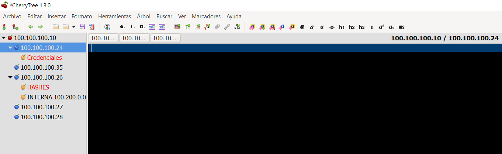
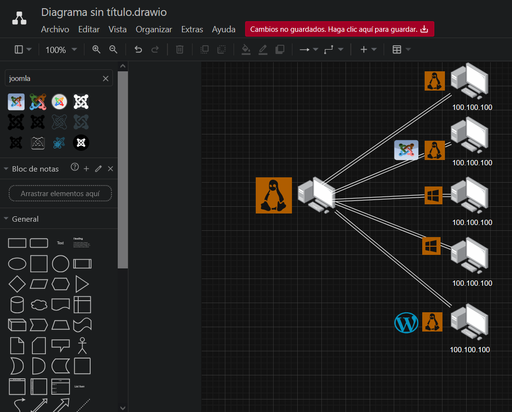

# Guía para la eJPTv2  
 

## Introducción  
En esta guía veremos contenido 100% práctico para poder estudiar para la eJPTv2. Se plantearán los principales contenidos tanto técnicos como pedagógicos para poder aplicar en el examen y desempeñarse de la mejor manera. Idealmente, es para entender todo lo que entra de manera directa sin profundizar en conceptos ni procesos.  

---

## Metodología para Realizar el Examen  
Es clave entender que el examen y la certificación en sí están basadas en un entorno empresarial real. Para poder desempeñarse como un buen pentester, hay fases que se aplican en la gran mayoría de casos, donde hay que ser ordenado y paciente. Las fases son las siguientes:  

### 1. Recolección Pasiva y Activa  
Primera fase en la cual tendremos el objetivo de reunir toda la información del o los objetivos. Entre estos se encuentran:  
- **DNS**: Identificación de dominios y subdominios.  
- **Subdominios**: Descubrimiento de subdominios asociados al objetivo.  
- **Puertos Expuestos**: Identificación de puertos abiertos y servicios asociados.  

### 2. Enumeración  
Segunda fase en la cual toda la información que obtuvimos hay que analizarla y buscar vulnerabilidades. Aquí se incluyen:  
- **Pruebas en Directorios**: Búsqueda de rutas y archivos expuestos.  
- **Bases de Datos Desprotegidas**: Identificación de bases de datos accesibles.  
- **Fuerza Bruta a Servicios Abiertos**: Ataques de fuerza bruta a servicios como SSH, FTP, etc.  

### 3. Explotación  
Tercera fase en la que procederemos a aprovecharnos de alguna vulnerabilidad para obtener privilegios de cualquier tipo, como:  
- **Acceso a Archivos**: Lectura o modificación de archivos sensibles.  
- **Shells Remotos**: Obtención de acceso a sistemas mediante shells.  
- **Datos y Usuarios**: Extracción de información sensible o credenciales.  

### 4. Postexplotación  
Cuarta fase en la que, luego de la explotación, tendremos que escalar privilegios si es necesario, dependiendo del alcance. Aquí nos preguntamos:  
- ¿Esta vulnerabilidad involucra a otros puertos o servicios?  
- ¿Nos podría servir para tener acceso a otros objetivos o información sensible?  

### 5. Documentación  
En esta etapa nos preocuparemos de documentar todo lo encontrado utilizando diagramas y notas. Esto es crucial para presentar un informe claro y profesional.  

---

## Estructura del Examen  
- **Temas clave**:  
  - **Redes**: Escaneo con Nmap a múltiples objetivos, barrido de ping para identificar redes internas, identificación de puertos abiertos, versión del servicio de cada puerto, uso de scripts de Nmap para identificar vulnerabilidades, identificación de OS de cada objetivo, entender la estructura de una IP, submáscara, escaneo sigiloso, UDP/TCP, entender servicios como SMB, FTP, RDP, identificar puertos más comunes con estos servicios, port forwarding, pivoting.  
  - **Web**: Fuzzing, detección de vulnerabilidades por versión, CMS, XSS, SQL Injection, fuerza bruta y hashes.  

- **Duración**: 48 horas.  
- **Formato**: Práctico, con preguntas basadas en el escenario entregado. Contiene preguntas de alternativa y preguntas dinámicas.  

### Ejemplos de Preguntas  
#### Preguntas de Alternativa  
**Ejemplo**: ¿Cuál es la contraseña de Luciano?  
- A) lol123  
- B) CITT123  
- C) telefono  
- D) password  

#### Preguntas Dinámicas  
**Ejemplo**: ¿Cuál es el contenido del archivo XXXX.txt del usuario X en X servidor y X ruta?  
- Ingresar respuesta:  

---

## Recursos Recomendados  
- **TryHackMe**:  
  - Máquinas adjuntas en [tryhackme.md](es/maquinas/tryhackme.md).  
  - Ruta de Junior Penetration Tester.  
- **Videos**:  
  - [Simulación de examen de Xerosec](https://www.youtube.com/watch?v=v20IsEd5nUU&t=2152s).  
  - [Simulación de examen de Zunder](https://www.youtube.com/watch?v=OYOA0oIhOJ0&t=401s).  

- **Herramientas Recomendadas**:  
  Las siguientes herramientas han sido seleccionadas en base a la recomendación de INE, y he agregado algunas que, en su totalidad, deberían ser suficientes para completar el examen sin problemas. También es recomendable siempre saber más de una herramienta para un objetivo, debido a los falsos positivos y diferentes problemas que se puedan dar. Por ejemplo, Hashcat y John.  

  - **Nmap**: Escaneo de puertos y detección de servicios.  
  - **Dirb**: Enumeración de directorios y archivos en servidores web.  
  - **Nikto**: Escaneo de vulnerabilidades en servidores web.  
  - **WPScan**: Escaneo de vulnerabilidades en sitios WordPress.  
  - **CrackMapExec**: Herramienta para auditorías en redes Windows.  
  - **The Metasploit Framework**: Framework para desarrollo y ejecución de exploits.  
  - **Searchsploit**: Búsqueda de exploits en la base de datos de Exploit-DB.  
  - **Hydra**: Herramienta de fuerza bruta para servicios de red.  
  - **Hashcat**: Herramienta para cracking de hashes.  
  - **John the Ripper**: Otra herramienta para cracking de hashes.  
  - **SQLMap**: Automatización de pruebas de SQL Injection.  
  - **Gobuster**: Enumeración de directorios y subdominios.   

- **Herramientas de organizacion**:
CherryTree

Herramienta altamente recomendada para poder armar la estructura de forma simple y no a un nivel tan profundo o complejo, ademas de poder hacer notas generales y en cada maquina donde se puede indicar un escaneo completo para esa maquina, puertos, servicios,etc

Draw.io

Herramienta muy recomendable para tener una vista topologica de la red y poder apuntar ciertos detalles de forma mas directa
---
  
-**Consejos**:

1-Es posible que la maquina que te entreguen para hacer el examen falle, esto puede ser desde no poder salir de el editor, los escaneos que no terminan y diferentes problemas que puedan haber, ante esto solamente detienes el laboratorio y puedes iniciarlo de nuevo para entrar a la maquina, lo que si debes apuntar todo ya que la maquina una vez reiniciada borra todos los archivos.

2-Tomatelo con calma, realiza la fase de reconocimiento y enumeracion de la mejor forma posible probando diferentes combinaciones con nmap para evitar equivocarte en preguntas de esta indole y ademas para luego no tener que volver a enumerar todo.

3-Documenta y anota todo, recuerda que estaras ante un entorno con diferentes IP con muchisimos servicios y puertos, es clave que seas ordenado y anotes todo lo que encuentres, esto te ayudara a mas adelante poder descartar a ciertas maquinas en algunas preguntas o poder confirmarlas. 

